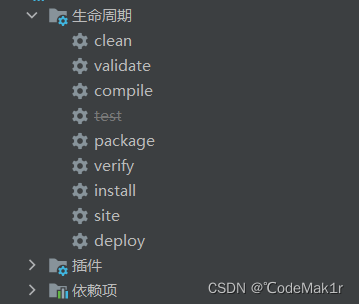
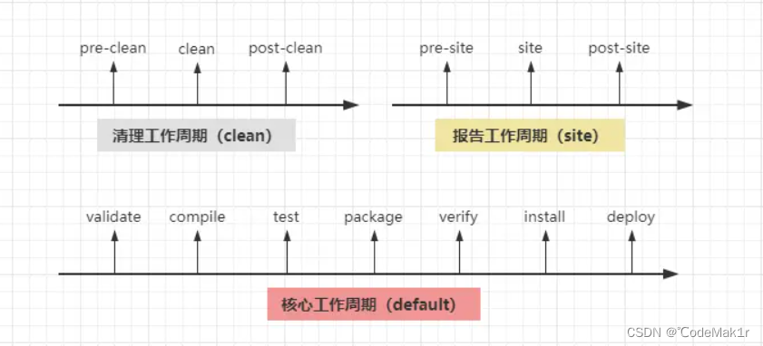
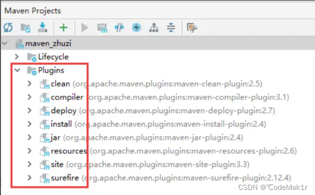

# maven
## 生命周期
[来源链接](https://blog.csdn.net/weixin_48994585/article/details/131576153)
通过IDEA工具的辅助，能很轻易看见Maven的九种生命周期命令，如下：
  
每个命令的作用：  
- clean：清除当前工程编译后生成的文件（即删除target整个目录）；  
  当我们执行构建操作（如编译、测试、打包等）时，会生成一些中间结果和最终产物，这些文件通常存放在项目根目录下的target目录中。通过运行mvn clean命令，Maven会首先执行clean生命周期中的clean阶段，清理整个target目录下的内容，不会动依赖的jar包。这样做可以确保在进行下一次构建时，之前的编译结果和生成的文件都被彻底清除，从而保证了一个干净的构建环境。
- validate：对工程进行基础验证，如工程结构、pom、资源文件等是否正确；  
  在执行Maven构建时，当进入到validate阶段时，Maven会检查项目的一些基本信息和配置是否存在问题或错误。例如，它会验证项目的目录结构是否符合规范，是否包含所需的源代码和资源文件，以及项目的POM文件是否正确配置了必要的依赖、插件和属性等。通过执行mvn validate命令或作为构建过程中较早的一个阶段，可以触发validate阶段的执行。如果在该阶段检测到任何问题或错误，Maven将报告相应的错误消息，并停止后续构建过程。验证阶段的目的是确保项目的基础设置和配置是正确的，以便能够顺利执行后续的编译、测试、打包等构建任务。它有助于提前发现并解决项目配置方面的问题，以避免在后续构建过程中出现潜在的错误或异常。
- compile：对src/main/java目录下的源码进行编译（会生成target目录）；  
  compile是默认生命周期中的一个阶段，用于对项目中的源代码进行编译。该阶段主要负责编译位于src/main/java目录下的Java源码文件。当执行Maven构建时，当进入到compile阶段时，Maven会使用Java编译器（例如Javac）将src/main/java目录下的源代码文件编译为字节码文件（.class文件）。编译后的结果会被输出到项目的target目录下。通过执行mvn compile命令或作为构建过程中的一个阶段，可以触发compile阶段的执行。如果在该阶段编译过程中发现了源代码的语法错误或其他问题，Maven将报告相应的错误消息，并停止构建过程。
- test：编译并执行src/test/java/目录下的所有测试用例；  
  执行 src/test/java/ 目录下的所有测试用例通常意味着执行其中使用了 @Test 注解标记的方法，以验证代码的正确性和稳定性。
- package：将当前项目打包，普通项目打jar包，webapp项目打war包；  
  将项目打包是指将项目的源代码、配置文件和依赖库等资源整合为一个可执行的文件或归档文件。打包完成的文件通常会被放置在项目的 target 目录下。这样可以方便地部署、分发和运行项目。在 Maven 中，使用 Maven 插件可以轻松地将当前项目打包成不同的形式，根据项目类型和需求，有两种常见的打包方式： 
  - 对于普通项目：可以将其打包为 JAR（Java Archive）文件。JAR 文件是一种归档格式，用于存储 Java 类、资源文件和依赖库等。它可以作为一个独立的可执行文件，并可以在 Java 虚拟机上运行。使用 Maven 打包成 JAR文件时，可以包含项目的编译结果以及相关的配置文件，使其方便地被其他项目引用和调用。
  - 对于 Web 应用程序（Web Application）项目：可以将其打包为 WAR（Web Application Archive）文件。WAR 文件是一种归档格式，用于打包和部署 Web 应用程序。它可以包含项目的编译结果、Web 资源、Servlet、JSP 页面、静态文件等，并可以在支持 Java Servlet 规范的 Web 容器中运行。使用 Maven 打包成 WAR 文件时，通常会将项目打包为一个独立可部署的文件，以便于在 Web 服务器上进行部署和发布。
- verify：验证工程所有代码、配置进行是否正确，如类中代码的语法检测等；  
  经过了编译打包，可能会出错，所以再检查一遍。verify 是软件开发中的一个步骤，用于验证工程中的代码和配置是否正确。它通常包括对代码进行语法检测、静态分析和其他类型的自动化检查，以确保代码的质量和一致性。 在软件开发过程中，为了减少错误和提高代码的可维护性，开发人员可以使用各种工具和技术来进行代码验证。
- install：将当前工程打包，然后安装到本地仓库，别人可通过GAV导入；  
  install是指将当前项目打包，并将该打包文件安装到本地仓库中，以便其他人可以通过引入该项目的GAV（Group/Artifact/Version）信息也就是依赖dependency来使用该项目。
  具体步骤如下：
  - 打包：首先，使用构建工具（如Maven或Gradle）执行打包命令，将项目的源代码编译为可执行文件或可部署的包。打包过程会根据项目的配置文件生成相应的构建产物。
  - 安装：然后，使用构建工具执行"install"命令，将项目的打包文件安装到本地仓库。本地仓库通常位于开发人员的计算机上，用于存储和管理本地构建和依赖项。
  - 导入：其他开发人员可以通过在其项目的配置文件中添加对该项目的 GAV 信息来导入该项目。GAV包括"Group"（组织）、“Artifact”（项目名称）和"Version"（版本号）等标识符，用于唯一标识一个特定的项目。  
  
  通过执行"install"命令并将项目安装到本地仓库，可以使其他开发人员能够方便地引入并使用该项目作为依赖项。这样做的好处是，避免了每个项目都需要重新构建和打包依赖项的麻烦，提高了开发效率和代码复用性。  
  
  一般在为服务项目中我们一般会设置一个commons基础模块，用来做一些公共的东西和通用的依赖，然后让其他模块引用这个模块的依赖
- site：生成项目的概述、源码测试覆盖率、开发者列表等站点文档（需要额外配置）；  
  site是指生成项目的站点文档，其中包括项目概述、源码测试覆盖率报告、开发者列表等信息。 生成站点文档需要进行额外的配置和操作。
  通常情况下，使用构建工具（如Maven或Gradle）执行"site"命令可以生成项目的站点文档。以下是一些常见的站点文档内容：
  - 项目概述：包括项目的描述、目标、功能特性等信息，用于向用户和其他开发人员介绍项目的基本情况和背景。
  - 源码测试覆盖率报告：通过运行单元测试并对代码进行分析，生成源码测试覆盖率报告。该报告显示了测试用例对项目代码的覆盖程度，帮助开发人员评估测试的完整性和质量。
  - 开发者列表：列出了参与项目开发的开发人员列表，包括他们的姓名、联系方式等信息。这样可以让其他人知道哪些开发人员参与了项目，方便合作和交流。
  - 通过生成站点文档，开发人员可以将项目的相关信息以易读且友好的方式展现出来，方便项目的理解、文档查阅和协作。此外，站点文档也可以作为项目的官方文档发布和分享。需要注意的是，生成站点文档通常需要根据项目的需要进行额外的配置和设置。具体的配置方法可以参考构建工具的文档或相关教程。
- deploy：将当前工程对应的包，上传到远程仓库，提供给他人使用（私服会用）。  
  deploy是指将当前工程对应的包或构建产物上传到远程仓库，以便他人可以从该仓库获取并使用这些包。
  通常情况下，开发人员使用构建工具（如Maven或Gradle）执行"deploy"命令，将构建好的项目包或库发布到远程仓库。远程仓库可以是公共的仓库，如Maven中央仓库，也可以是私有的仓库，如企业内部搭建的私服。
  以下是"deploy"的一些关键概念和流程：
  - 包或构建产物：在软件开发中，项目经过构建打包之后会生成相应的包或构建产物，用来提供给其他开发人员使用。这些包可以是可执行文件、库文件、插件等，根据项目类型和需求而定。
  - 远程仓库：远程仓库是存储和管理包和构建产物的地方，以供他人进行访问和下载。公共远程仓库（如Maven中央仓库）通常包含了大量的开源包供社区使用，而私有远程仓库（如企业内部私服）则用于存储特定组织或项目的包。
  - 配置认证信息：为了能够向远程仓库发布内容，需要在构建工具的配置文件中提供相应的认证信息，如用户名和密码。这些信息用于验证发布者的身份，并确保只有授权用户才能上传内容。  

  通过执行"deploy"命令并提供认证信息，开发人员可以将当前工程对应的包或构建产物上传到远程仓库，使他人可以方便地获取和使用这些软件资源。这样做的好处是，避免了每个开发人员都需要重新构建和打包项目的麻烦，提高了代码的复用性和共享性。
  需要注意的是，执行"deploy"命令需要确保远程仓库的地址和认证信息正确配置，并且具备相应的权限和访问权限。  

上述便是九个周期阶段命令的释义。
Maven划分的三套生命周期：

主要看default这套，该生命周期涵盖了构建过程中的检测、编译、测试、打包、验证、安装、部署每个阶段。注意一点：同一生命周期内，执行后面的命令，前面的所有命令会自动执行！比如现在执行一条命令：
``` maven test```   
test命令位于default这个生命周期内，所以它会先执行validate、compile这两个阶段，然后才会真正执行test阶段。  

还可以一起执行多个命令，如：
```mvn clean install```  
这两个命令隶属于不同的周期，所以会这样执行：先执行clean周期里的pre-clean、clean，再执行default周期中，validate~install这个闭区间内的所有阶段。  
从上面不难发现，default是Maven的核心周期，但其实上面并没有给完整，因为官方定义的default一共包含23个小阶段，上面的图只列出了七个核心周期，对详细阶段感兴趣的可以自行了解。  

Maven中只定义了三套生命周期，以及每套周期会包含哪些阶段，而每个阶段具体执行的操作，这会交给插件去干，也就是说：Maven插件会实现生命周期中的每个阶段，这也是大家为什么看到IDEA的Lifecycle下面，还会有个Plugins的原因：



## 常用命令
| 命令          | 描述                                            |
|-------------|-----------------------------------------------|
| mvn clean   | 对项目进行清理，删除target目录下编译的内容                      |
| mvn compile | 编译项目源代码                                       |
| mvn test    | 对项目进行运行测试                                     |
| mvn package | 打包文件并存放到项目的target目录下，打包好的文件通常都是编译后的class文件    |
| mvn install | 在本地仓库生成仓库的安装包，可供其他项目引用，同时打包后的文件放到项目的target目录下 |

- mvn clean package //依次执行了clean、resources、compile、testResources、testCompile、test、jar(打包)等７个阶段
   package命令完成了项目编译、单元测试、打包功能，但没有把打好的可执行jar包（war包或其它形式的包）布署到本地maven仓库和远程maven私服仓库
- mvn clean install //依次执行了clean、resources、compile、testResources、testCompile、test、jar(打包)、install等8个阶段
   install命令完成了项目编译、单元测试、打包功能，同时把打好的可执行jar包（war包或其它形式的包）布署到本地maven仓库，但没有布署到远程maven私服仓库
- mvn clean deploy //依次执行了clean、resources、compile、testResources、testCompile、test、jar(打包)、install、deploy等９个阶段
   deploy命令完成了项目编译、单元测试、打包功能，同时把打好的可执行jar包（war包或其它形式的包）布署到本地maven仓库和远程maven私服仓库
- mvn clean package -Dmaven.test.skip=true //跳过单元测试打包
- mvn clean install -Dmaven.test.skip=true //跳过单元测试打包，并把打好的包上传到本地仓库
- mvn clean deploy -Dmaven.test.skip=true //跳过单元测试打包，并把打好的包上传到远程仓库
- mvn -v //查看版本
- mvn archetype:create //创建 Maven 项目
- mvn compile //编译源代码
- mvn test-compile //编译测试代码
- mvn test //运行应用程序中的单元测试
- mvn site //生成项目相关信息的网站
- mvn package //依据项目生成 jar 文件
- mvn install //在本地 Repository 中安装 jar
- mvn -Dmaven.test.skip=true //忽略测试文档编译
- mvn clean //清除目标目录中的生成结果
- mvn clean compile //将.java类编译为.class文件
- mvn clean package //进行打包
- mvn clean test //执行单元测试
- mvn clean deploy //部署到版本仓库
- mvn clean install //使其他项目使用这个jar,会安装到maven本地仓库中
- mvn archetype:generate //创建项目架构
- mvn dependency:list //查看已解析依赖
- mvn dependency:tree com.xx.xxx //看到依赖树
- mvn dependency:analyze //查看依赖的工具
- mvn help:system //从中央仓库下载文件至本地仓库
- mvn help:active-profiles //查看当前激活的profiles
- mvn help:all-profiles //查看所有profiles
- mvn help:effective -pom //查看完整的pom信息